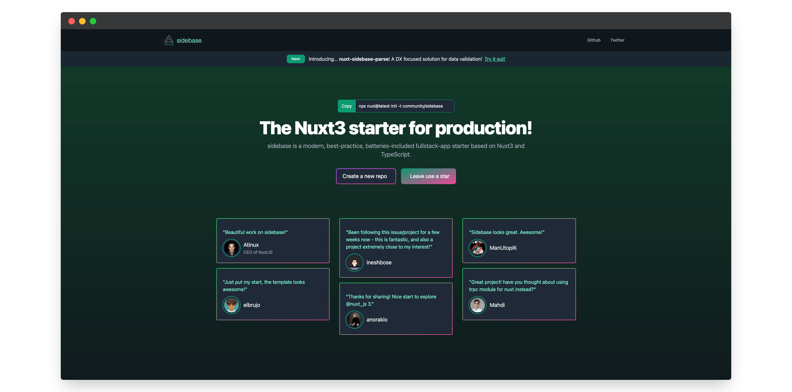

# sidebase.io

> With **sidebase** every new project feel like a fun side-project while scaling to production.

This is the website of `sidebase`, a modern, best-practice, batteries-included fullstack-app starter based on Nuxt3 and TypeScript.

## Quick start

1. Clone the repository
    ```sh
    git clone https://github.com/sidestream-tech/sidebase-website
    ```
2. Go into the `app/` directory
    ```sh
    cd app/
    ```
3. Install the dependencies
    ```sh
    npm i
    ```
4. Start developing (with database, backend, API, ... running) at [localhost:3000](http://localhost:3000)
    ```sh
    npm run dev
    ```

## Commands and Further Documentation

You can also:
- `npm run story` for isolated component development using `histoire`
- `npm run test` for testing
    - `npm run test -- -u` to update the component snapshots
    - `npm run test -- -t "test describe text"` to run a specific test
    - `npm run test:ui` to start the [vitest UI](https://vitest.dev/guide/ui.html)
- `npm run lint` for linting using `eslint`
- `npm run build` for bundling using `vite`

### Deployment
[sidebase.io](https://sidebase.io) is hosted with GitHub Pages.
GitHub automatically deploys the contents of the `/docs` folder.
In order to force a redeployment run
```sh
npm run generate
```
in the `/app` folder. Once this is completed be sure to push the changes made to the `docs` folder.
